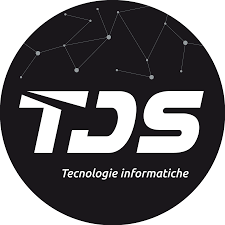

# Contenuti del sito personale — TEMPLATE DI ESEMPIO

> **Nota d'uso**: questo file contiene tutto il testo necessario per il sito personale di un ipotetico studente del 5° anno dell'IIS Marconi Pieralisi di Jesi, indirizzo Informatica e Telecomunicazioni. I dati sono **inventati**: ogni studente deve sostituirli con i propri (nome, foto, esperienze, progetti, premi, ecc.) mantenendo la stessa struttura. I segnaposto del tipo `[DA PERSONALIZZARE]` indicano i punti in cui inserire le proprie informazioni reali.

---

## 0. DATI ANAGRAFICI E IDENTITÀ

- **Nome e Cognome**: Luca Tonelli
- **Età**: 19 anni
- **Residenza**: Ostra (AN)
- **Scuola**: IIS "Marconi Pieralisi" di Jesi
- **Indirizzo**: Informatica e Telecomunicazioni
- **Classe**: 5ª CM — Anno scolastico 2025/2026
- **Email**: lucatonelli07@gmail.com
- **Instagram**: @luca_tons7
- **GitHub**: github.com/LucaTons

---

> **Nota importante per la pagina Home**: le sezioni 1, 2 e 3 vivono **sulla stessa pagina (`index.html`)** in scorrimento verticale. Sono state scritte come un unico racconto che si sviluppa naturalmente: prima un saluto breve, poi la presentazione personale e di studi, poi le passioni. Evita quindi qualsiasi "anticipo" tra una sezione e l'altra: ogni argomento viene introdotto una sola volta, nel momento in cui viene approfondito.

## 1. HOME — Hero di apertura

### Titolo della pagina
Luca Tonelli

### Sottotitolo
Studente di Informatica — IIS "Marconi Pieralisi", Jesi

### Frase di benvenuto (1 riga sotto il sottotitolo)
Cinque anni tra scuola, passioni e progetti: questo è il percorso che mi ha accompagnato fino a qui.

### Pulsanti CTA dell'hero
- "Scopri di più" → ancora alla sezione "Chi sono" (`#chi-sono`)
- "Le mie materie" → link a `materie.html`

---

## 2. CHI SONO

### Presentazione (paragrafo principale)
Ho 19 anni e vivo a Ostra, un piccolo comune in provincia di Ancona. Sono una persona curiosa: mi piace capire come funzionano le cose, smontarle (a volte anche letteralmente) e rimontarle cercando di migliorarle. È proprio questa curiosità che, durante il periodo del Covid, mi ha avvicinato al mondo dell’informatica e che oggi mi porta a immaginare un futuro in cui possa contribuire a proteggere le persone dagli attacchi informatici. Gli amici, il legame con i professori e i compagni di classe che ho conosciuto durante questi cinque anni rappresentano la parte più importante del mio percorso.

### Il mio percorso di studi
Ho frequentato la scuola primaria e la scuola secondaria di primo grado nel mio paese, per poi scegliere l’IIS “Marconi Pieralisi” di Jesi. La scelta non è stata casuale: volevo una scuola che mi desse competenze pratiche insieme a una buona base teorica. Durante il triennio ho approfondito programmazione, database, reti e progettazione software, e ho capito che i settori che mi interessano di più sono sistemi e reti e la cybersecurity. Dopo il diploma vorrei continuare iscrivendomi all’ITS System & Cyber di Fabriano.

### Uno sguardo al futuro
So che ho ancora molto da imparare, ma ho le idee abbastanza chiare su dove voglio andare: lavorare nel campo della cybersecurity e costruire un percorso professionale concreto partendo dalle basi che ho costruito in questi cinque anni.

### Immagini suggerite
- `immagini/profilo.jpg` — foto profilo dello studente (sostituibile)
- `immagini/scuola-marconi.jpg` — istituto Marconi Pieralisi

---

## 3. PASSIONI

### Frase di passaggio (1 riga, fa da ponte con la sezione precedente)
La scuola occupa una parte importante delle mie giornate, ma non è tutto. Ci sono tre cose che, fuori dall'aula, mi raccontano meglio di qualsiasi voto: i videogiochi, gli amici e la tecnologia.

### 3.1 VideoGiochi
I videogiochi sono una delle passioni che mi accompagnano da molti anni. Mi piace giocare soprattutto a giochi d'azione e sparatutto, ma anche a giochi più creativi e basati sulla costruzione, come Minecraft. Quello che mi interessa non è solo giocare, ma anche capire cosa c'è dietro: mi piace creare e programmare server personalizzati, modificarli e aggiungere funzionalità, come mods e plugin custom, per renderli più originali e adatti a esperienze di gioco personalizzate. Questa passione mi ha permesso di sviluppare curiosità, capacità di problem solving e interesse verso la programmazione.

### 3.2 Amici
Passare del tempo con gli amici è una parte importante della mia quotidianità. Mi piace stare in compagnia, uscire, condividere esperienze e vivere momenti che permettono di creare ricordi e rafforzare i rapporti.
Nel tempo ho anche capito che non tutte le persone sono uguali: l'amicizia è qualcosa che richiede fiducia, rispetto e sincerità reciproca. A volte alcune persone possono dimostrarsi diverse da come appaiono e per questo ho imparato che non bisogna fidarsi subito di tutti, ma conoscere davvero chi si ha accanto. Credo che i veri amici siano quelli che restano presenti sia nei momenti belli sia in quelli più difficili e che contribuiscono a farti crescere come persona.

### 3.3 Tecnologia
La tecnologia è la passione che ha guidato la mia scelta scolastica e quella che continua a occupare gran parte del mio tempo libero. Mi piace assemblare computer, individuare problemi hardware e cercare soluzioni ai diversi problemi tecnici che possono presentarsi.
Spesso mi capita di sperimentare, provare nuovi programmi o approfondire argomenti legati all'informatica e alla cybersecurity, perché mi piace imparare continuamente qualcosa di nuovo.

### Immagini suggerite per le passioni
- `immagini/passione-tecnologia.jpg`

---

## 4. MATERIE SCOLASTICHE

> > Il piano di studi del 5° anno dell'IIS Marconi Pieralisi (indirizzo Informatica) comprende materie di area tecnico-scientifica e umanistica. Per ciascuna viene presentato un argomento che mi è rimasto più impresso.

### AREA TECNICA

#### 4.1 Informatica

**Le applicazioni Web**

Quest'anno ho studiato come vengono sviluppate le applicazioni web: dai database al PHP, fino alla collaborazione in gruppo su un progetto reale. Mi ha colpito soprattutto la parte sulla cybersecurity applicata al web: ho analizzato vulnerabilità come le SQL Injection, che permettono di manipolare un database tramite input malevoli, e il Cross-Site Scripting, che consente di iniettare script dannosi nelle pagine viste dagli utenti. La cosa che mi ha interessato di più è stata ragionare non solo come sviluppatore, ma anche come un attaccante che cerca di sfruttare quelle vulnerabilità: è un cambio di prospettiva che cambia completamente il modo in cui si scrive codice.

#### 4.2 Sistemi e Reti

**La sicurezza informatica e la protezione dei dati**

Durante l'anno ho approfondito come vengono protetti dati e sistemi informatici, studiando tecniche di sicurezza e l'importanza della crittografia per impedire accessi non autorizzati. Un esempio concreto è stato lo studio delle reti WiFi: abbiamo analizzato i protocolli WEP, WPA e WPA2, capendo perché alcuni sono considerati vulnerabili e facilmente aggirabili, e come una rete mal configurata possa diventare un punto di accesso per chi vuole intercettare il traffico o rubare dati. Ho scelto questo argomento perché è uno di quelli in cui si vede subito il collegamento tra teoria e vita reale: ci connettiamo a reti WiFi ogni giorno senza pensarci, eppure i rischi sono concreti.

#### 4.3 TPSIT — Tecnologie e Progettazione di Sistemi Informatici e di Telecomunicazione

**Lo sviluppo di applicazioni Android**

L'argomento che mi ha colpito di più durante l'anno è stato lo sviluppo di applicazioni Android, perché mi è piaciuto capire come viene creata un'app che può essere usata ogni giorno sul telefono.
Durante l'anno abbiamo studiato la struttura di un'applicazione e come creare schermate e funzioni per permettere all'utente di interagire con l'app. Abbiamo anche visto come organizzare un progetto e sviluppare un'app in modo corretto.
Ho scelto questo argomento perché mi ha fatto capire meglio il lavoro che c'è dietro alle applicazioni che utilizziamo tutti i giorni e mi ha fatto avvicinare ancora di più al mondo della programmazione. Un esempio concreto è stato lo sviluppo di una calcolatrice Android: partendo da zero abbiamo dovuto progettare l'interfaccia grafica, gestire i pulsanti e implementare la logica dei calcoli, affrontando tutti quei dettagli che da utente non si notano mai ma che richiedono attenzione e organizzazione durante lo sviluppo.

#### 4.4 GPOI — Gestione Progetto e Organizzazione d'Impresa

**La gestione di un progetto software**

L'argomento che mi ha colpito di più durante l'anno è stato la gestione di un progetto software, perché mi ha fatto capire che creare un programma non significa solo scrivere codice.
Durante l'anno abbiamo studiato come organizzare un progetto, partendo dalla pianificazione fino alla realizzazione finale. Abbiamo visto strumenti come l'analisi dei requisiti, la divisione dei compiti e la gestione dei tempi di lavoro per rendere un progetto più organizzato ed efficiente.
Ho scelto questo argomento perché mi ha fatto capire quanto sia importante lavorare in modo organizzato e quanto la collaborazione sia fondamentale per realizzare un progetto. Un esempio concreto è stato Scout Admin, un progetto reale che abbiamo dovuto pianificare e gestire seguendo tutte le fasi studiate: dalla raccolta dei requisiti alla divisione dei compiti tra i membri del gruppo, fino alla gestione dei tempi e delle priorità. Lavorare su un progetto concreto mi ha fatto capire quanto la parte organizzativa sia tanto importante quanto quella tecnica.

---

#### 4.5 Matematica

**Il calcolo delle probabilità**

Il calcolo delle probabilità mi ha colpito perché mi ha fatto vedere la matematica da un’angolazione diversa. Non si tratta solo di formule: abbiamo studiato come calcolare la probabilità che un evento accada, come ragionare su situazioni incerte e come usare questi strumenti per prendere decisioni. È uno di quegli argomenti in cui capisci che la matematica non serve solo a fare calcoli, ma può aiutarti a ragionare meglio nella vita reale.

---

#### 4.6 Intelligenza Artificiale

**Il Machine Learning**

Il Machine Learning mi ha colpito perché l'idea che un sistema possa imparare dai dati e migliorare le proprie risposte è qualcosa che, prima di studiarlo, sembrava quasi fantascienza. Durante l'anno abbiamo visto come l'intelligenza artificiale analizza le informazioni, riconosce schemi e fa previsioni, e abbiamo approfondito diversi metodi di apprendimento e il funzionamento delle reti neurali. Ho scelto questo argomento perché l'intelligenza artificiale è già ovunque nella vita di tutti i giorni e capire come funziona davvero è sempre più importante. Un esempio concreto è stato il progetto sul Deep Learning, dove non ci siamo limitati a studiare la teoria ma abbiamo costruito e addestrato una rete neurale reale su Google Colab: scegliendo il dataset, progettando l'architettura e poi vedere il modello migliorare gradualmente durante l'addestramento mi ha fatto capire davvero cosa significa "far imparare" una macchina.

---

### AREA UMANISTICA

#### 4.7 Italiano

**Il Verismo e Giovanni Verga**

Ho trovato interessante il Verismo e Giovanni Verga perché racconta la realtà delle persone senza abbellirla: parla di situazioni difficili e problemi reali, soprattutto delle classi più povere del Sud Italia. Verga descrive la vita di contadini e pescatori mostrando la loro fatica e i loro sacrifici, senza giudicare e senza inventare finali felici. La cosa che mi ha colpito di più è la sua idea che l'opera d'arte debba sembrare come se si fosse creata da sola, senza che si noti la presenza dello scrittore. Ho scelto questo argomento perché mi ha fatto capire che la letteratura può raccontare la realtà in modo onesto, e che certi temi come la povertà e le difficoltà economiche sono ancora attuali oggi. Durante l'anno abbiamo letto diversi suoi testi: Rosso Malpelo, che racconta la storia di un ragazzo sfruttato che lavora in una miniera e vive una vita piena di violenze, La Lupa, dove una donna viene giudicata e rifiutata dalla società, e La Roba, dove un uomo dedica tutta la vita ad accumulare ricchezze senza godersi niente. Abbiamo poi letto anche parti de I Malavoglia e Mastro don Gesualdo, dove Verga racconta come chi cerca di migliorare la propria vita spesso finisce per perdere tutto il resto.

---

#### 4.8 Storia

**La crisi del 1929 e le difficoltà economiche**

Ho scelto la crisi del 1929 perché mi ha fatto capire come un problema economico nato in un paese possa in poco tempo coinvolgere il mondo intero. La crisi iniziò negli Stati Uniti e portò a perdita di lavoro, chiusura di aziende e difficoltà economiche per milioni di famiglie in tutto il mondo. Studiare come i governi hanno cercato di rispondere a quella situazione mi ha aiutato a capire quanto l’economia e la politica siano legate, e quanto certi meccanismi si ripetano anche nel presente.

---

#### 4.9 Inglese

**Alan Turing**

The topic that interested me the most during the year was Alan Turing and computer science, because he was one of the first people who helped create the foundations of modern computers.
Alan Turing was an English mathematician and computer scientist. During the Second World War he worked on decoding secret messages and helped develop ideas that later became important for modern computer science. Today he is considered one of the fathers of computer science.
I chose this topic because it helped me understand how one person’s work can change the future of technology that we use every day.

**Alan Turing**

Ho scelto Alan Turing perché la sua storia mi ha colpito sia dal punto di vista tecnico che umano. Durante la Seconda Guerra Mondiale lavorò per decifrare i codici Enigma e contribuì in modo decisivo allo sviluppo delle basi teoriche dell’informatica moderna: oggi viene considerato uno dei padri dell’informatica. Allo stesso tempo, è una figura che dice molto anche su come la società tratta chi è diverso: nonostante il suo contributo, fu perseguitato per la sua omosessualità. Ho scelto questo argomento perché si collega naturalmente sia all’informatica che alla storia, e perché racconta quanto il lavoro di una sola persona possa cambiare il futuro.
Collegamento possibile all’orale: da Turing si può passare all’informatica (fondamenti teorici), alla Seconda Guerra Mondiale (crittografia e conflitto) e ai diritti civili (riabilitazione postuma nel 2013).

---

### ALTRO

#### 4.10 Scienze Motorie

**Il cuore**

Ho trovato interessante studiare il cuore e il suo funzionamento durante l’attività fisica perché è un argomento che riguarda direttamente tutti noi. Il cuore è un muscolo che pompa il sangue in tutto il corpo e durante lo sforzo fisico lavora di più per portare ossigeno ai muscoli. Mi ha colpito capire come il corpo si adatti nel tempo all’allenamento e quanto fare movimento regolarmente sia importante non solo per le prestazioni sportive, ma per la salute in generale.

---

## 5. EDUCAZIONE CIVICA — Percorso interdisciplinare

> Educazione Civica al Marconi Pieralisi viene affrontata come percorso tematico annuale, sviluppato in modo interdisciplinare tra le diverse materie. Lo studente di esempio sceglie come tema il **Cyberbullismo e cittadinanza digitale**, particolarmente coerente con un indirizzo informatico.

### Titolo del percorso
**Cittadinanza digitale: usare la rete con consapevolezza**

### 5.1 Introduzione al tema
Trascorriamo online buona parte della nostra giornata, eppure quasi nessuno ci ha mai insegnato a starci. Per il percorso di Educazione Civica ho scelto la cittadinanza digitale: cosa significa partecipare alla vita pubblica in rete in modo consapevole, e cosa accade quando questa consapevolezza manca — dal cyberbullismo alla disinformazione, fino all'uso disinvolto dei nostri dati personali.

### 5.2 Cos'è la cittadinanza digitale
Essere cittadini digitali significa partecipare in modo attivo, consapevole e responsabile alla vita della società attraverso gli strumenti digitali. Implica conoscere i propri diritti (alla privacy, all'oblio, alla protezione dei dati personali) e i propri doveri (rispetto degli altri, attendibilità delle informazioni che si condividono, uso etico delle tecnologie). La cittadinanza digitale non è un concetto astratto: si esercita ogni volta che pubblichiamo un post, che chiediamo un'informazione a un assistente vocale, che usiamo una carta di credito online.

### 5.3 Il cyberbullismo
Il cyberbullismo è una delle forme più insidiose di violenza che la rete ha reso possibile. A differenza del bullismo tradizionale, agisce 24 ore su 24, può raggiungere un pubblico potenzialmente illimitato, e spesso si nasconde dietro l'anonimato. Le forme più comuni includono insulti ripetuti tramite messaggi, diffusione non consensuale di immagini, esclusione sistematica dai gruppi online e creazione di profili falsi per danneggiare la reputazione di qualcuno. In Italia, la legge 71/2017 è stata la prima in Europa a contrastare specificamente il cyberbullismo.

### 5.4 Privacy e protezione dei dati
Ogni clic, ogni ricerca, ogni "mi piace" lascia una traccia. Il Regolamento Generale sulla Protezione dei Dati (GDPR), entrato in vigore in tutta l'Unione Europea nel 2018, ha rappresentato un passo fondamentale per restituire alle persone il controllo sui propri dati personali. Capire concetti come consenso informato, diritto all'oblio, data breach e profilazione è oggi una competenza di base, esattamente come saper leggere un contratto.

### 5.5 Disinformazione e pensiero critico
Le fake news non sono un'invenzione di oggi, ma i social network le hanno trasformate in un fenomeno di massa. Riconoscere una notizia falsa richiede tempo, strumenti e abitudini mentali che vanno coltivate: verificare la fonte, confrontare più testate affidabili, diffidare dei titoli "acchiappa-click", fare attenzione a immagini e video manipolati (deep fake). La scuola e la famiglia hanno un ruolo fondamentale nell'educare al pensiero critico digitale.

### 5.6 Conclusione
La cittadinanza digitale non è una questione tecnica, ma una questione di responsabilità. Le competenze tecnologiche che acquisiamo a scuola hanno senso solo se accompagnate da una bussola etica: la rete può essere un luogo straordinario di crescita e di incontro, ma solo se ognuno di noi sceglie di esserci con rispetto, onestà e consapevolezza. Il mio percorso scolastico in Informatica mi ha dato gli strumenti per comprendere come funziona la tecnologia: ora sta a me, e a tutti i miei coetanei, decidere come usarla.

---

## 6. FSL — Formazione Scuola Lavoro

> *Azienda inventata a scopo didattico*. Lo studente reale sostituirà con i dati della propria esperienza in azienda.

### 6.1 L'azienda: Tecno Data Sistem Srl

Tecno Data System S.r.l. (TDS) è un’azienda informatica con sede a Corinaldo (AN), nelle Marche. Si occupa di servizi IT per aziende, enti e privati, offrendo soluzioni come sviluppo software, assistenza tecnica, manutenzione hardware e supporto informatico.
L’azienda lavora anche nello sviluppo di applicazioni web e servizi digitali, oltre a fornire consulenza per la gestione dei sistemi informatici e della sicurezza dei dati.
TDS è una realtà di piccole-medie dimensioni, composta da circa una decina di dipendenti, e opera principalmente sul territorio locale. L’azienda punta molto sull’assistenza ai clienti e sulla risoluzione di problemi informatici, offrendo supporto sia da remoto sia in presenza.

### 6.2 Il mio ruolo: Junior Developer e Tecnico 

Durante l'attività di FSL ho ricoperto il ruolo di Junior Developer nel reparto sviluppo software e di Tecnico in laboratorio. Nelle prime due settimane sono stato affiancato a uno sviluppatore senior che ha fatto da tutor aziendale, mentre nelle tre settimane successive ho lavorato in laboratorio con un altro tutor occupandomi della parte hardware dei computer.

### 6.3 Mansioni principali

**Supporto allo sviluppo e osservazione attività frontend**
Durante la parte di sviluppo software ho affiancato gli sviluppatori osservando il loro lavoro e ascoltando le spiegazioni sulle attività che stavano svolgendo. In alcuni casi ho dato supporto nella gestione e sistemazione di file e materiali utili al progetto.

**Gestione dati e aggiornamento gestionale**
Ho aiutato nella sistemazione di file Excel dei clienti, organizzando e correggendo i dati per facilitare il lavoro del team. Inoltre mi sono occupato dell’aggiornamento del gestionale aziendale, inserendo nuove aziende e partite IVA e rimuovendo quelle non più attive o non esistenti. Questa attività mi ha permesso di capire meglio come vengono gestite le informazioni in un contesto reale di lavoro.

**Attività di testing**
Ho svolto anche attività di testing, provando le applicazioni e cercando eventuali errori o bug. Questo mi ha permesso di contribuire al miglioramento del lavoro finale segnalando problemi e anomalie riscontrate.

**Attività di assistenza tecnica e manutenzione hardware**
Durante il lavoro in laboratorio mi sono occupato della manutenzione dei computer. Ho eseguito operazioni di smontaggio e rimontaggio dei PC, sostituzione di componenti hardware, aggiornamento dei sistemi operativi da Windows 10 a Windows 11 e installazione di programmi richiesti. Ho anche contribuito alla preparazione e configurazione delle postazioni di lavoro.

### 6.4 Approccio al lavoro

All’inizio entrare in un ambiente lavorativo è stato impegnativo, perché c’erano strumenti e procedure che non conoscevo. Con il tempo ho imparato a chiedere quando avevo dubbi, a osservare i colleghi e a cercare soluzioni in autonomia quando possibile.
Ho acquisito sempre più sicurezza e sono riuscito a svolgere alcune attività in modo più indipendente, sentendomi parte del lavoro quotidiano del team.

### 6.5 Hard skills acquisite

-Utilizzo base di strumenti di sviluppo e gestione dati
-Organizzazione e sistemazione di file Excel
-Aggiornamento e gestione di un sistema gestionale aziendale
-Attività di testing e individuazione di bug
-Installazione e configurazione di software
-Aggiornamento di sistemi operativi Windows (10 → 11)
-Montaggio e smontaggio di PC e sostituzione componenti hardware
-Comprensione dei flussi di lavoro in un’azienda informatica

### 6.6 Soft skills acquisite

-Capacità di lavorare in team
-Comunicazione con colleghi e tutor aziendale
-Gestione del tempo e delle attività assegnate
-Problem solving
-Capacità di adattamento a un ambiente lavorativo reale
-Attenzione ai dettagli
-Apprendimento rapido di nuove competenze

### 6.7 Riflessione personale

L’esperienza di FSL è stata molto utile perché mi ha permesso di vedere da vicino come funziona un ambiente di lavoro reale e come vengono svolte le attività in un’azienda informatica.
Al rientro a scuola mi sono trovato un po’ in difficoltà, perché mi ero abituato a un contesto più pratico e dinamico. Il lavoro quotidiano, con attività concrete come gestione dati, testing e supporto operativo, mi è sembrato più stimolante rispetto alla routine scolastica.
Nonostante questo, ho capito che la scuola è fondamentale perché fornisce le basi teoriche necessarie per lavorare in questo settore. L’esperienza mi ha aiutato a capire meglio le mie preferenze e a orientarmi su ciò che mi piace fare davvero.

---

## 7. CONTATTI

- **Email**: lucatonelli07@gmail.com
- **Telefono**: +39 3398947954
- **Indirizzo**: Via San Gregorio, 89 — 60010 Ostra (AN)
- **GitHub**: github.com/LucaTons
- **Instagram**: @luca_tons7

---

## 8. NOTE DI STILE E TONO PER LA SCRITTURA

> Da ricordare quando si personalizzano i contenuti per il proprio sito personale.

- **Tono**: caldo ma misurato, mai eccessivamente informale. Lo studente racconta sé stesso a un pubblico ampio (commissione d'esame, futuri datori di lavoro, conoscenti).
- **Persona**: prima persona singolare ("Io credo che...", "Durante il quinto anno ho avuto modo di...").
- **Lunghezza dei paragrafi**: medi (4-7 righe). Evitare frasi troppo brevi e telegrafiche, ma anche periodi infiniti.
- **Tecnicismi**: usarli quando servono (è una scuola tecnica), ma sempre con un breve chiarimento.
- **Coerenza**: la persona descritta in "Chi sono" deve essere coerente con le passioni, con le scelte fatte nel percorso e con quanto raccontato dell'attività FSL.
- **Aggiornamento**: ogni studente sostituisce nomi, date, aziende, premi, foto e dettagli personali con i propri.

---

## 9. APPENDICE — Mappa delle immagini disponibili

> Nella cartella `immagini/`ci sono le immagini. Usa esattamente questi nomi file quando inserisci i tag `` nelle pagine HTML. Tutte le immagini hanno una risoluzione di 1200×800 px.

### Profilo e scuola
- `immagini/profilo.jpg` — foto profilo dello studente (PLACEHOLDER, da sostituire con foto reale)
- `immagini/scuola-marconi.jpg` — istituto Marconi Pieralisi
- `immagini/univpm-ancona.jpg` — Università Politecnica delle Marche (per "sguardo al futuro")
- `immagini/home-hero.jpg` — immagine di hero per la pagina principale
- `immagini/contatti-bg.jpg` — sfondo decorativo per la pagina contatti

### Passioni
- `immagini/passione-videogiochi.jpg`
- `immagini/passione-tecnologia.jpg`

### Materie — area scientifica/tecnica
- `immagini/materia-informatica.jpg`
- `immagini/materia-sistemi-reti.jpg`
- `immagini/materia-tpsit.jpg`
- `immagini/materia-gpoi.jpg`
- `immagini/materia-matematica.jpg`
- `immagini/materia-ia.jpg` (Intelligenza Artificiale)

### Materie — area umanistica
- `immagini/materia-italiano.jpg`
- `immagini/materia-storia.jpg`
- `immagini/materia-inglese.jpg`

### Altre materie
- `immagini/materia-scienze-motorie.jpg`

### Educazione Civica
- `immagini/edcivica-cittadinanza-digitale.jpg` (apertura del percorso)
- `immagini/edcivica-cyberbullismo.jpg` (sezione cyberbullismo)
- `immagini/edcivica-fake-news.jpg` (sezione disinformazione)

### FSL
- `immagini/fsl-azienda.jpg` (sede TDS Solutions)
- `immagini/fsl-lavoro.jpg` (postazione/scrivania)